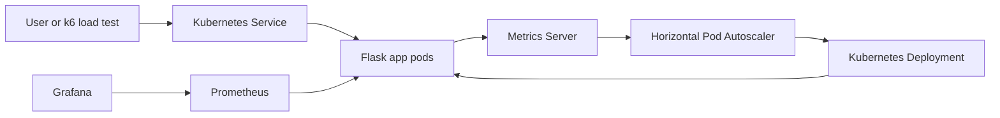

# Kubernetes Autoscaling Demo

A portfolio-ready DevOps project that demonstrates Kubernetes Horizontal Pod Autoscaling with a containerized Flask app, Minikube, Metrics Server, Prometheus, Grafana, and k6 load testing.

The goal is to show the full workflow: build an app, package it in Docker, deploy it to Kubernetes, generate CPU load, and watch Kubernetes scale pods up and down automatically.

## Screenshots

Add screenshots after running the demo locally.

| App | HPA Scaling | Grafana |
| --- | --- | --- |
| `docs/screenshots/app.png` | `docs/screenshots/hpa.png` | `docs/screenshots/grafana.png` |

## Architecture



## What This Project Demonstrates

- Python Flask API with health, version, and CPU load endpoints.
- Docker image built with a non-root user and a container healthcheck.
- Kubernetes Deployment, Service, ConfigMap, Namespace, and HPA manifests.
- CPU requests and limits so the HPA has reliable scaling signals.
- Minikube workflow for local Kubernetes practice.
- Metrics Server setup for Kubernetes CPU metrics.
- Prometheus and Grafana monitoring guidance.
- k6 load testing to trigger autoscaling.
- GitHub Actions workflow for tests, Docker build, and Kubernetes manifest validation.

## Folder Structure

```text
kubernetes-autoscaling-demo/
├── .github/workflows/ci.yml
├── app/
│   ├── __init__.py
│   └── main.py
├── docs/
│   ├── grafana/
│   │   └── dashboard-placeholder.json
│   └── screenshots/
│       └── .gitkeep
├── kubernetes/
│   ├── configmap.yaml
│   ├── deployment.yaml
│   ├── hpa.yaml
│   ├── namespace.yaml
│   └── service.yaml
├── load-tests/
│   └── k6-cpu-load.js
├── tests/
│   └── test_app.py
├── Dockerfile
├── README.md
├── requirements-dev.txt
└── requirements.txt
```

## API Endpoints

| Endpoint | Purpose |
| --- | --- |
| `/` | Basic app landing response |
| `/health` | Healthcheck endpoint for Docker and Kubernetes |
| `/version` | Shows app version and runtime metadata |
| `/cpu-load` | Creates temporary CPU work to trigger autoscaling |
| `/metrics` | Prometheus metrics endpoint |

Example:

```sh
curl http://localhost:5000/version
```

## Prerequisites

- Docker 24 or newer
- Python 3.12 or newer
- Minikube
- kubectl
- k6
- Helm, for Prometheus and Grafana setup

Check your tools:

```sh
docker --version
python --version
minikube version
kubectl version --client
k6 version
helm version
```

## Run Locally Without Kubernetes

1. Create a virtual environment:

   ```sh
   python -m venv .venv
   source .venv/bin/activate
   ```

2. Install dependencies:

   ```sh
   pip install -r requirements.txt -r requirements-dev.txt
   ```

3. Start Flask locally:

   ```sh
   flask --app app.main run --host 0.0.0.0 --port 5000
   ```

4. Test the app:

   ```sh
   curl http://localhost:5000/
   curl http://localhost:5000/health
   curl http://localhost:5000/version
   curl "http://localhost:5000/cpu-load?seconds=2"
   ```

5. Run tests:

   ```sh
   pytest -q
   ```

## Run With Docker

Build the image:

```sh
docker build --tag kubernetes-autoscaling-demo:local .
```

Run the container:

```sh
docker run --rm -p 5000:5000 kubernetes-autoscaling-demo:local
```

Check health:

```sh
curl http://localhost:5000/health
```

Expected output:

```json
{"status":"ok"}
```

## Minikube Setup

Start Minikube:

```sh
minikube start --cpus=4 --memory=4096
```

Enable Metrics Server:

```sh
minikube addons enable metrics-server
```

Verify Metrics Server:

```sh
kubectl get pods -n kube-system | grep metrics-server
kubectl top nodes
```

Point Docker to Minikube, then build the image inside Minikube's Docker environment:

```sh
eval $(minikube docker-env)
docker build --tag kubernetes-autoscaling-demo:local .
```

Apply Kubernetes manifests:

```sh
kubectl apply -f kubernetes/
```

Check resources:

```sh
kubectl get all -n autoscaling-demo
kubectl get hpa -n autoscaling-demo
```

Open the service:

```sh
minikube service flask-autoscaling-service -n autoscaling-demo
```

## HPA Demo Steps

1. Watch pods in one terminal:

   ```sh
   kubectl get pods -n autoscaling-demo -w
   ```

2. Watch the HPA in another terminal:

   ```sh
   kubectl get hpa flask-autoscaling-hpa -n autoscaling-demo -w
   ```

3. Forward the service locally:

   ```sh
   kubectl port-forward -n autoscaling-demo service/flask-autoscaling-service 5000:80
   ```

4. Run k6 load test from another terminal:

   ```sh
   k6 run load-tests/k6-cpu-load.js
   ```

5. Watch Kubernetes scale the deployment:

   ```sh
   kubectl get deployment flask-autoscaling-app -n autoscaling-demo
   kubectl describe hpa flask-autoscaling-hpa -n autoscaling-demo
   ```

Expected HPA output after load begins:

```text
NAME                    REFERENCE                          TARGETS    MINPODS   MAXPODS   REPLICAS
flask-autoscaling-hpa   Deployment/flask-autoscaling-app   85%/50%    2         10        4
```

Expected scale-down behavior:

- Pods scale up while CPU usage remains above the target.
- Pods scale down after traffic stops and Kubernetes stabilization windows pass.
- Scale-down can take several minutes. That delay is normal.

## Monitoring With Prometheus and Grafana

Install the Prometheus community Helm chart:

```sh
helm repo add prometheus-community https://prometheus-community.github.io/helm-charts
helm repo update
helm install monitoring prometheus-community/kube-prometheus-stack \
  --namespace monitoring \
  --create-namespace
```

Check monitoring pods:

```sh
kubectl get pods -n monitoring
```

Open Grafana:

```sh
kubectl port-forward -n monitoring service/monitoring-grafana 3000:80
```

Then open:

```text
http://localhost:3000
```

Get the default admin password:

```sh
kubectl get secret -n monitoring monitoring-grafana \
  -o jsonpath="{.data.admin-password}" | base64 --decode
```

Useful metrics to explore:

- Pod CPU usage
- Pod memory usage
- Deployment replica count
- HPA desired replicas
- Request rate to `/cpu-load`
- Flask request count from `/metrics`

A starter Grafana dashboard placeholder is included at:

```text
docs/grafana/dashboard-placeholder.json
```

## Important Kubernetes Concepts

- **Resource requests** tell Kubernetes how much CPU and memory a pod is expected to need.
- **Resource limits** cap how much CPU and memory a pod can use.
- **Metrics Server** provides CPU and memory metrics to Kubernetes.
- **HPA** reads those metrics and changes the replica count.
- **Prometheus** stores monitoring metrics.
- **Grafana** visualizes metrics in dashboards.
- **`/metrics`** exposes app-level Prometheus metrics from Flask.

## Troubleshooting

### HPA shows `<unknown>` for CPU

Metrics Server may not be ready yet.

```sh
kubectl get pods -n kube-system | grep metrics-server
kubectl top pods -n autoscaling-demo
```

Wait one or two minutes, then check again.

### Pods do not scale up

Check these items:

- The Deployment has CPU requests.
- Metrics Server is running.
- k6 is sending traffic to `/cpu-load`.
- The HPA target is lower than the generated CPU usage.

Useful commands:

```sh
kubectl describe hpa flask-autoscaling-hpa -n autoscaling-demo
kubectl top pods -n autoscaling-demo
kubectl logs -n autoscaling-demo deployment/flask-autoscaling-app
```

### ImagePullBackOff in Minikube

The image may not exist inside Minikube's Docker environment.

```sh
eval $(minikube docker-env)
docker build --tag kubernetes-autoscaling-demo:local .
kubectl rollout restart deployment/flask-autoscaling-app -n autoscaling-demo
```

### Port 5000 is already in use

Use a different local port:

```sh
kubectl port-forward -n autoscaling-demo service/flask-autoscaling-service 5001:80
```

Then update the k6 target:

```sh
BASE_URL=http://localhost:5001 k6 run load-tests/k6-cpu-load.js
```

### Scale-down takes too long

This is normal. Kubernetes intentionally avoids rapidly scaling down because sudden traffic spikes can return.

## Resume Bullet Points

- Built a Kubernetes autoscaling demo using Flask, Docker, Minikube, Metrics Server, and Horizontal Pod Autoscaling.
- Containerized a Python application with non-root execution, health checks, and production-style Gunicorn serving.
- Created Kubernetes manifests with namespace isolation, ConfigMap configuration, CPU requests, memory limits, Service exposure, and HPA policies.
- Added k6 load testing to generate CPU pressure and demonstrate automatic pod scaling behavior.
- Documented Prometheus and Grafana monitoring setup for observing application and cluster metrics.
- Implemented GitHub Actions CI to run Python tests, build the Docker image, and validate Kubernetes YAML.

## Cleanup

Delete the app:

```sh
kubectl delete namespace autoscaling-demo
```

Stop Minikube:

```sh
minikube stop
```
